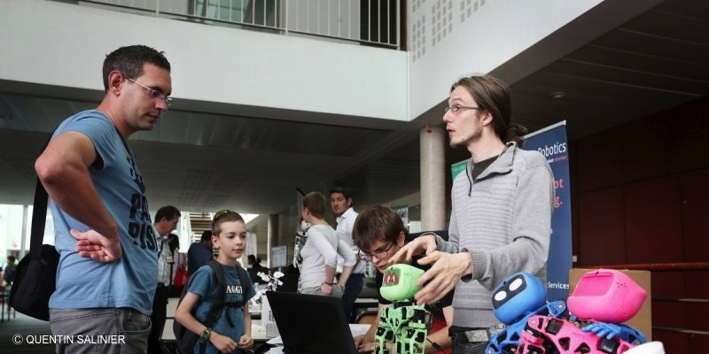

<h1 style="text-align:center ; font-size:100% ; font-family:futura" > Atelier <i>Poppy</i> pour la Robot Maker's Day - 13 juin 2015 </h1>

 
 ---

---

## Atelier

* Realiser _**plusieurs mouvements**_ avec _Poppy Torso_ via _**Snap!**_
* Découvrir l'enregistrement de _**mouvements par démonstration**_ avec les bras de _Poppy Torso_

<table>

    <tr>
        
        <td>  </td>
        <td>  </td>
        <td>  </td> 
        
    </tr>
</table>

 

---
## Ressources Atelier

* Fiche nom des moteurs et fiche Snap! --> <a href"https://github.com/Antoine-Darfeuil/Poppy-Education/tree/master/Images">_ici_</a>
